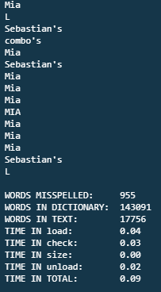

# Speller.c
C Program that implements a dynamically allocated hash table to spell check input files

To run the program:
<ol>
  <li>Compile the program</li>
  <li>Run the program with a text file name as a command line argument (you may pick one of the files in the texts folder)</li>  
</ol>

Ex:

<code>./speller texts/lalaland.txt</code>

#### Output:

Program outputs a list of all misspelled words along with key stats about the program runtime and file errors.
